<div align="center">

</div>

# NeuroSmith Neural Architect (MVP)

**A deterministic, multimodal neural network design studio built with Google AI Studio.**

NeuroSmith transforms **simple canvas sketches**, **structured dropdown selections**, and **optional voice commands** into a clean, deterministic `MODEL_SPEC` and corresponding deep-learning code (PyTorch or TensorFlow).  
It is designed for rapid neural architecture prototyping — without hallucination, without randomness, and with an intuitive UI.

---

## 🖼 System Architecture Diagram

```mermaid
graph TD
    A[🎨 Canvas Blueprint] --> E[Multimodal Inputs]
    B[📋 Dropdown Config] --> E
    C[🎤 Voice Commands] --> E
    
    E --> F[Intent Interpreter]
    F --> G[MODEL_SPEC<br/>Canonical JSON]
    
    G --> H[NeuroSmith Deterministic Compiler]
    
    H --> I[📄 Generated Code<br/>PyTorch / TensorFlow]
    H --> J[📊 Architecture Diagram<br/>SVG]
    H --> K[📈 Metrics Estimation<br/>Params / FLOPs / Memory]
    
    subgraph "Compiler Passes"
        H1[Validation Pass] --> H2[Transform Pass] --> H3[Codegen Pass]
    end
```



*Figure: NeuroSmith's deterministic compilation pipeline — multimodal inputs are normalized into a canonical MODEL_SPEC, then processed through validation, transformation, and code generation passes to produce reproducible outputs.*

---

## 📊 Architecture

**Key Components:**
1. **Multimodal Inputs** - Canvas, dropdowns, voice commands
2. **Intent Interpreter** - Normalizes inputs with deterministic defaults
3. **MODEL_SPEC** - Canonical, hashable architecture representation
4. **Deterministic Compiler** - Three-pass validation/transformation/codegen
5. **Outputs** - Code, diagrams, and metrics

---

# ⭐ Why NeuroSmith Matters  
In a world rapidly shifting toward *no-code* and *vibe-coding* AI systems, users can describe intentions and receive entire applications or architectures automatically.  
This unlocks creativity and speed — but it also introduces three major risks:

---

### ❗ 1. Non-Determinism  
The same prompt can yield different outputs, making debugging and reproducibility extremely difficult.

**NeuroSmith solves this with:**  
**Deterministic Mode** → same inputs always produce identical architectures and code.  
No randomness. No drift. No hidden state.

---

### ❗ 2. Hallucinated or Invalid Architectures  
LLMs can generate architectures that are syntactically valid but structurally broken:  
missing Flatten layers, incorrect tensor shapes, unsupported ops, etc.

**NeuroSmith solves this with:**  
A **bounded, template-driven compiler** that only emits safe, framework-valid components.  
Defaults (ReLU, Softmax) ensure stability even when unspecified.

---

### ❗ 3. Lack of Auditability  
If a vibe-coded model is wrong, the user has no way to fix the system.  
It remains a black box.

**NeuroSmith solves this with:**  
A transparent, patchable workflow:  
- Clear `MODEL_SPEC`  
- Visible validations  
- Deterministic templates  
- Users can file issues → each issue becomes a rule update  
- The system gets *safer* over time  

NeuroSmith isn't just an AI tool —  
It's a **governed, deterministic architecture compiler** for the no-code era.

---

## 📸 UI Preview

NeuroSmith's MVP interface shows deterministic neural architecture generation across diagram, code, and metrics tabs.  
Here are examples from the working prototype:

---

### 🧩 Architecture Stack → Deterministic Code
<div align="center">

<br/>
<sub>Users select a simple CNN architecture, and NeuroSmith compiles it deterministically into clean PyTorch code.</sub>
</div>

---

### 🧠 Architecture Diagram (Auto-Generated)
<div align="center">

<br/>
<sub>NeuroSmith renders a clear block-level diagram based on the user-defined architecture sequence.</sub>
</div>

---

### 📊 Metrics Panel (MVP Placeholder)
<div align="center">

<br/>
<sub>Metrics tab displays placeholder estimates for parameters, FLOPs, memory, and training time (computed metrics planned in roadmap).</sub>
</div>

---

### 🎤 Voice Input + Deterministic Mode Toggle
<div align="center">

<br/>
<sub>Voice command module (strict mode) and Deterministic Mode toggle reinforce the safety-first, reproducible architecture generation workflow.</sub>
</div>

---

### 🕵 Proof Panel
<div align="center">

<br/>
<sub>Voice command module (strict mode) and Deterministic Mode toggle reinforce the safety-first, reproducible architecture generation workflow.</sub>
</div>

---

## 📄 Design

**NeuroSmith — Deterministic Neural Architecture Compiler**  
*Author: Prakhar Prasun*  
*Status: MVP*  
*Last Updated: Dec 2025*

### 1. Objective
NeuroSmith enables users to design neural networks using multimodal inputs (canvas drawings, dropdown selections, voice commands) and compiles them into deterministic, validated `MODEL_SPEC` objects and corresponding deep-learning code.

The system eliminates hallucination, nondeterminism, and structural inconsistencies that commonly arise in LLM-based architecture generation.

### 2. Key Requirements
**Functional**
- Accept three input modalities (canvas, dropdowns, voice)
- Normalize all inputs into a unified deterministic `MODEL_SPEC`
- Enforce architectural validity via a rule-based compiler
- Generate reproducible PyTorch/TensorFlow code
- Provide diagrams and metrics per compiled model

**Non-Functional**
- **Determinism**: same input → same `MODEL_SPEC` → same code
- **Safety**: prevent illegal sequences, missing shapes, invalid defaults
- **Auditability**: output must be hashable and reproducible
- **Extensibility**: adding new layers or rules should not break existing flows

### 3. System Architecture
```
Input Layer → Intent Interpreter → MODEL_SPEC → Deterministic Compiler → Outputs
```

#### 3.1 Input Layer
- **Canvas**: captures topology hints
- **Dropdowns**: precise architecture control  
- **Voice**: lightweight adjustments

#### 3.2 Intent Interpreter
**Responsibilities:**
- Convert multimodal input into structured representations
- Insert deterministic defaults
- Apply safety constraints (e.g., allowed layer set)
- Output: normalized canonical `MODEL_SPEC`

#### 3.3 MODEL_SPEC
The single source of truth for every backend output.
- Framework (pytorch or tensorflow)
- Model type (cnn, mlp, rnn, transformer)
- Ordered list of layers + hyperparameters
- Canonical JSON → SHA-256 hashed for reproducibility

#### 3.4 Deterministic Compiler
**Three passes:**
1. **Validation Pass**
   - Detect illegal layer transitions
   - Ensure required components (e.g., Flatten before Dense)
   - Flag high-severity issues that block generation

2. **Transform Pass**
   - Insert missing defaults (e.g., ReLU, kernel sizes)
   - Normalize ops across frameworks
   - Rewrite ambiguous or incomplete definitions

3. **Codegen Pass**
   - Template-based emission for PyTorch & TensorFlow
   - No sampling, no creative generation
   - Fully reproducible outputs

#### 3.5 Outputs
- **Generated Code** → .py
- **Architecture Diagram** → SVG
- **Metrics** → param count, FLOPs, memory (MVP placeholder)

### 4. Determinism Guarantees
- Fixed allowable layer set
- Canonical ordered `MODEL_SPEC`
- Deterministic defaults for missing values
- Rule-based transforms
- SHA-256 hashing
- LLM calls made only in template-bounded, temperature=0 mode
- No internal hidden state

**Thus:**  
`MODEL_SPEC(input) = constant ⇒ Code(output) = constant`

### 5. Alternatives Considered
| Approach | Decision | Reason |
|----------|----------|--------|
| LLM-First Codegen | Rejected | Nondeterminism, hallucination, lack of auditability |
| Graph-First Architecture Inference (via CV on canvas) | Rejected | Noise sensitivity, lower reliability |
| Full symbolic compiler (no LLM) | Accepted | Deterministic paths; LLM only for natural-language → JSON conversion |

### 6. Risks & Mitigations
| Risk | Mitigation |
|------|------------|
| Ambiguous voice input | Transcribe → normalize → validated MODEL_SPEC |
| Architecture drift | Deterministic defaults + versioned rule engine |
| Framework mismatch | Framework-specific passes during compilation |
| Invalid shapes | Validation + Transform passes insert missing Flatten ops |

### 7. Future Extensions
- Shape-tracing graph engine
- ONNX export
- Auto-optimizer search (bounded, deterministic)
- GPU-aware FLOPs estimator
- Full visual editing mode
- Versioned rule engine for safety governance

### 8. Conclusion
NeuroSmith demonstrates that multimodal neural network design does not require prompt engineering or unconstrained LLM behavior. By treating the system as a deterministic compiler, it becomes:
- **Reproducible** - Same input always yields same output
- **Safe** - Bounded operation space prevents invalid architectures
- **Auditable** - Transparent compilation pipeline
- **Explainable** - Every decision traceable to a rule
- **Extendable** - Modular pass-based architecture

Ideal for research, education, and industry applications requiring reliable neural architecture generation.

---

## 🎯 Features (MVP)
- **Canvas Sketch Input** – capture rough architecture structure  
- **Layer Stack Builder** – select layer types and hyperparameters  
- **Deterministic Mode** – ensures reproducible output (same input → same code)  
- **Voice Input (Optional)** – simple parameter refinements  
- **Generate Model Code Button** – produces template-based, stable code  
- **Output Panel** – shows placeholder text, shimmer animation, and generated code  
- **Metrics Placeholder** – (Params / FLOPs / Memory shown as "—")

> This is the MVP release — additional planned features such as advanced validation, SVG diagrams, FLOPs calculation, and ONNX/Colab export appear in the roadmap but are not implemented yet.

---

## 🚀 Run Locally

**Prerequisite:** Node.js 18+

### 1. Install dependencies
```bash
npm install
```

### 2. Add your Gemini API key
Create or edit `.env.local`:
```ini
GEMINI_API_KEY=your_key_here
```

### 3. Launch development server
```bash
npm run dev
```

## 🌐 AI Studio Version
You can view the app directly in Google AI Studio:

https://ai.studio/apps/drive/12HPWkoQkexkFdS43IW2oUVdF66I-15X-

(This link is generated by and hosted on AI Studio.)

---

## 🛣️ Roadmap (Post-MVP)
- Architecture diagram generation (SVG)
- FLOPs / parameter / memory estimation
- Enhanced validation checks (shape tracing, illegal sequences)
- Expanded template gallery (ResNet, U-Net, Transformer)
- Colab export for instant training
- ONNX export pipeline

---

## 📄 License
This project is released under the MIT License.

## 🖊️ Citation
Prakhar Prasun. NeuroSmith: A Deterministic Multimodal Neural Network Architect. https://www.kaggle.com/competitions/gemini-3/writeups/neurosmith-a-deterministic-multimodal-neural-netw. 2025. Kaggle

<div align="center">
NeuroSmith – Deterministic Neural Network Compiler (MVP)<br/>
Sketch. Select. Generate.
</div>
